# 2023-09-04

It's a map with roads on it!

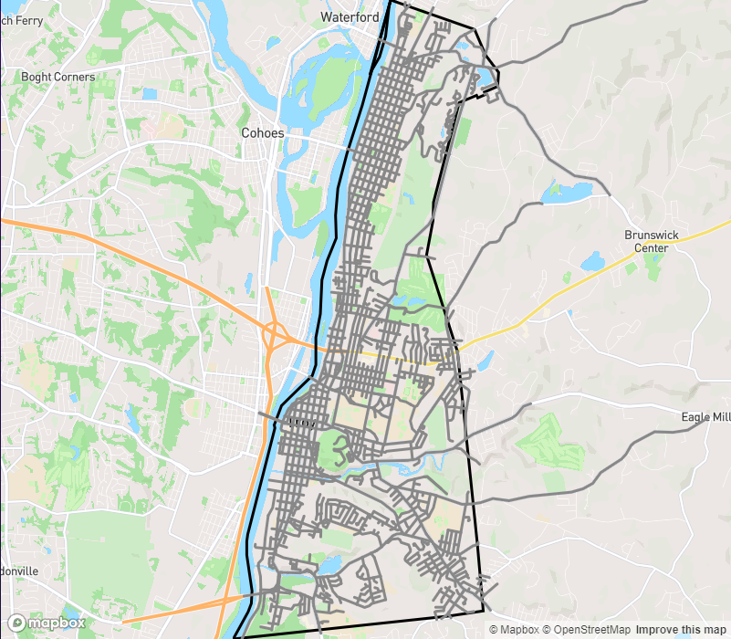

Today's accomplishments:

- I set up mock servers with Postman of the external APIs, so I can set up caching and rate limiting without hitting the real services.
- I researched some database options (Redis, MongoDB) and realized it wasn't the best use of my time. Sticking with sqlite for now. Once I have a better understanding of my needs I can revisit this.
- Made my first Prisma schema and set up basic long-term caching of search requests.
- I refined my Overpass queries for city boundaries and road data and integrated the two together, then got the data rendering on the map.

Things to do next:

- Sketch out a few potential UI designs for the landing page and gameplay page (on paper!)
  - Design is less comfortable to me than coding, but dedicating some time to it will give me confidence as I need to lay out more of the game page to get it functional. More fun when it looks nice rather than random stuff sitting on a page!
- Basic guessing function. Flip a line's color, maybe add a text label at high zoom.
- Geo data cleanup.
  - Combine road segments with the same name (even if disjoint?), trim roads as they leave the city boundary.
  - Parse the JSON from Overpass to something more structured, and eventually cache it so it doesn't need to be recomputed every page load.

# 2023-09-20

Road clipping works! Green segments are clipped:

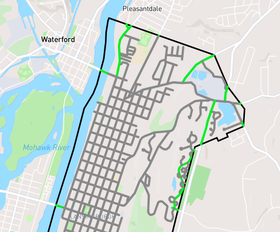

# 2023-09-30

Did today:

- Caching for OpenStreetMap responses, and the transformed geodata so it only needs to be computed once per city.
- Rate limiting for Nominatim requests, using [bottleneck](https://www.npmjs.com/package/bottleneck). This can rate limit across node instances using Redis, if I need that later.

Things to do next:

- Improve render performance. It's really really sluggish on initial load.
  - MapBox static image generation, to pre-generate an image of the roads and then overlay correctly guessed ones on top?
  - After reading the MapBox [performance doc](https://docs.mapbox.com/help/troubleshooting/mapbox-gl-js-performance/), this is the way I think: [feature-state](https://docs.mapbox.com/help/troubleshooting/mapbox-gl-js-performance/#use-feature-state)/[example](https://docs.mapbox.com/mapbox-gl-js/example/hover-styles/)
- Guessing visual feedback, some indicator that a guess is right/wrong/already guessed
- Better suffix matching, using standard postcode suffixes
- Label correctly guessed roads - [StackOverflow](https://stackoverflow.com/questions/40430307/mapbox-how-can-i-add-a-label-to-a-linestring)
- Difficulty levels: first letter given for easy mode, suffix optional for normal, require correct suffix for hard

# 2023-10-01

Goal: Improve render performance  
Strategy: Switch to a single GeoJson source/layer for roads with `feature-state` controlling color

Initial performance: The first two animation calls take 12s total (first red line in the image), after which the city labels are drawn on the map. During this time, all the `addSource` and `addLayer` calls are being processed. It takes a further 7s for more internal rendering work (second red line in the image), dominated by functions called `update` and `_updateSources`. In the last two seconds of this period, the city border and roads filter onto the screen. After 19s total, the page finally becomes responsive.

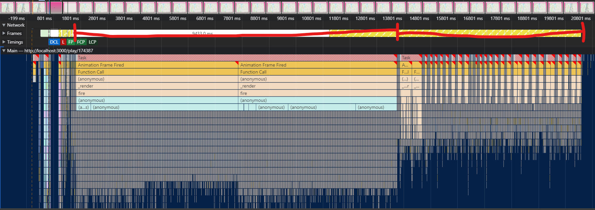

This was my first time using the "Performance" tab in the Chrome developer console. It's really useful for getting hard numbers here, and in this case it confirmed my suspicion that all the `addSource` and `addLayer` calls were the main driver of the slow render time.

# 2023-10-02

After switching all roads to a single source and layer, the total time for the map to render the same city is just 700ms, a **96% improvement**. I tried a big city, Los Angeles, and it took just a second to render. Success!

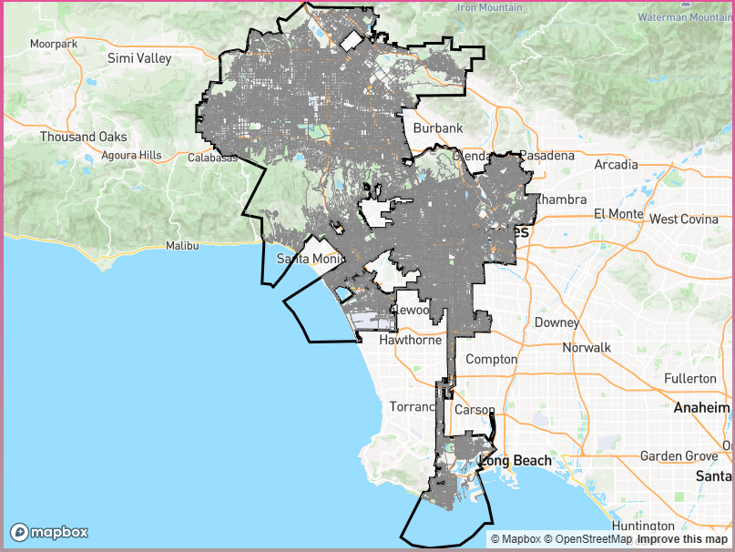

# 2023-10-05

Got two game UI tasks done today: guess feedback and road labels.

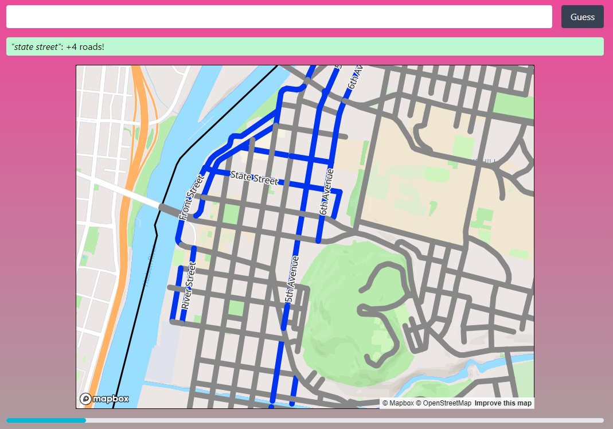

I learned about how to do CSS transitions with Tailwind, to animate the guess feedback box to stretch open when it first appears, and to change between colors based on if the guess was right (green), wrong (red), or a repeat (yellow). I also had the idea to shake the guess button a bit if a guess was wrong but I feel that might come across too mean to the player. I could still do it, we'll see. Once I got that done it was easy to animate the mileage progress bar as well.

Text labels were pretty simple with the MapBox API. I did find one shortcoming: animating properties isn't possible with data-driven styling, the method I switched to on 10/1. There's been an [open issue](https://github.com/mapbox/mapbox-gl-js/issues/7121) for this since 2018. I had the line color animating before but I hadn't noticed it had stopped working. This is more noticable with the text labels popping in suddenly. If the lack of animation really bothers me I could try adding the text labels one by one like my old road drawing method, but that may hurt performance.

I have been putting a some thought into the UI design as I go, following my initial sketches, but mainly I've focused on functionality. Once I have a good sense of all the elements I want on the page I'll need to do new sketches and give the whole thing a coherent design for all screen sizes. And definitely pick a color palette, that blue road color is getting to me. #programmerart

You may notice the screenshot says "+4 roads!", but I know for certain there's only one State Street in this city. Most roads in OpenStreetMap are made up of many segments with different IDs, divided up where properties of the road like the number of lanes change. In addition to the miscounting, this also creates little unsightly blobs where the segments join at high zoom levels. To fix these, I want to join segments together where they have the same name and meet at a point.

Next up:

- Loose street suffix matching. I'm mulling over doing this on the client or server side. I'll also want to handle things like "N" for "North".
- Difficulty levels. Labels was one blocker for this, suffix matching is the remaining one.
- Street joining.

# 2023-10-12

Over the weekend I did some thinking about the direction of the project, what I want to take from the games that inspired this one and what I want to leave behind. My vision is more focused now, and while I'll keep some of my ideas as stretch goals, I won't let them block an initial release.

I also started thinking about the UI design a bit more concretely, which spurred me to do a design pass on the landing page:

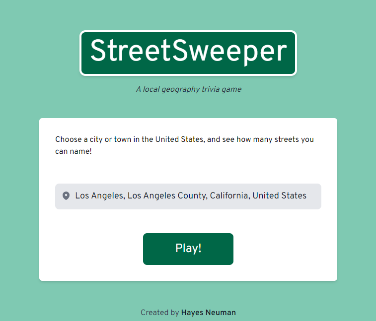

I think it looks pretty good! Definitely things I will tweak further. I have to shout out the book _[Refactoring UI](refactoringui.com)_ here. Before reading that I don't think I could have designed something like the above. It's got a lot of practical advice for engineers who want to step up their design skills.

# 2023-10-31

Today I got going on something I've been excited about: a visual redesign focusing on the street sign motif. First pass on the landing page:

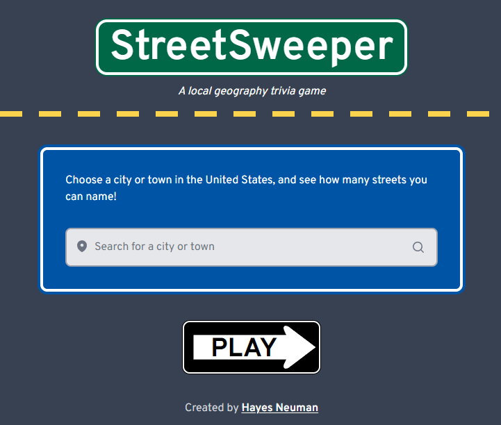

It's a really distinctive and fun look (not to mention high contrast), but I'll have to be careful to make sure it stays clean and usable as an interface. I couldn't find a good SVG of a one-way sign for the "PLAY" button, so I created that one in Inkscape.

For the game page, it didn't make sense to me to have the map on a sign. After some thought, I landed on a cute solution: a paper map!

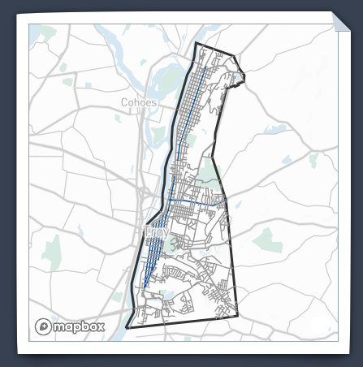

I really like how this turned out. This was my first time using [`filter`](https://developer.mozilla.org/en-US/docs/Web/CSS/filter) and [`clip-path`](https://developer.mozilla.org/en-US/docs/Web/CSS/clip-path), and it's really astonishing what you can accomplish with modern CSS. I took inspiration from CSS demos by [Saman Rohanizade](https://codepen.io/SamanRohanizade/pen/opgdKZ) and [Martin Wolf](https://codepen.io/martinwolf/pen/GRaWPy), as well as Temani Afif's [CSS custom corner generator](https://css-generators.com/custom-corners/).

# 2023-11-28

Wow, I did a lot in the last month without updating the log.

## Design

I've iterated on the visual design a few times since, and this is what the desktop home and game pages look like today:

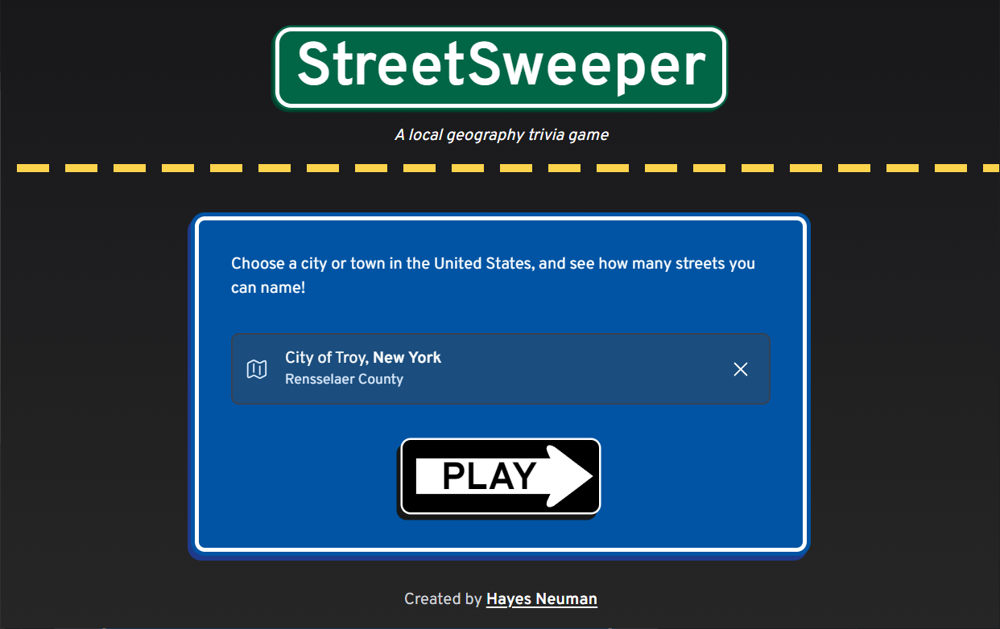

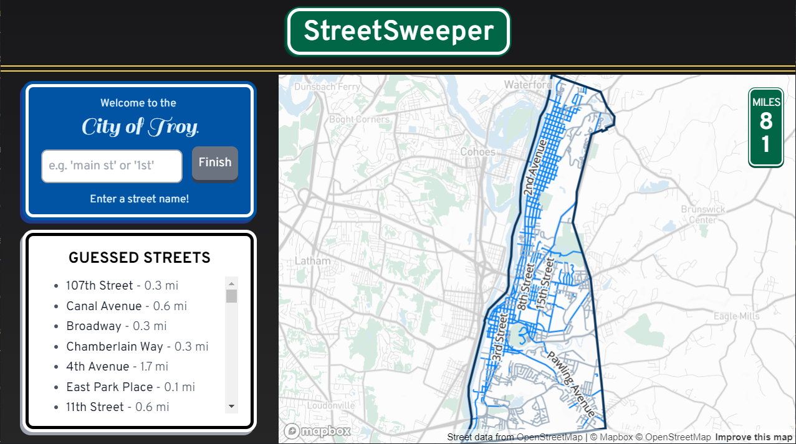

I'm really happy with the sign cards and the typography. Still not 100% satisfied with the overall look. I decided not to go with the paper map effect even though I was so endeared to it. It doesn't mesh with the other elements I'm using, and takes attention away from the map contents, especially on mobile. Ah well, I have [the code](https://github.com/neurosie/streetsweeper/blob/1cb5e1b0c823fcd7991d80b9fab1d29e03f0d437/src/styles/globals.css#L11) for it now. Someday I'll find a use.

## A database tale

I started with SQLite as a database for development, knowing I'd need to change to a different DBMS later. Well, it's later. I set a goal for myself to have an alpha playtest by Thanksgiving, and that meant setting up hosting. I went with Vercel, and at first I decided to use their managed Postgres integration. I switched over my DB config, pushed and it worked seamlessly. Great!

Except, the next day, I had a problem:  
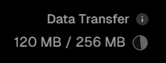  
I used up half my monthly data transfer limit in a day, with just a single player (me). Obviously not sustainable. And I had a pretty good idea why.

I had three tables, `Search`, `OsmResponse`, and `Place`. Each of these are essentially caching JSON objects. `Search` stores cached search result responses from Nominatin, a few KB each. `OsmResponse` caches raw GeoJSON data from the OpenStreetMap API, and `Place` caches my API responses after I've done my transforms on that same data. (I decided to cache them both so I could update my transforms without refetching the initial data, minimizing load on OSM.) These are really big objects, serialized and stored in a string field. For San Francisco, the `Place` entry is 2MB, and the `OSMResponse` entry is **11MB**. Yup, that's where my data transfer is going.

Storing JSON blobs in my database was convenient for prototyping, but it was now time for a more practical solution. This is a job for AWS S3. I set up a bucket, [hooked everything up](https://github.com/neurosie/streetsweeper/commit/1cb5e1b0c823fcd7991d80b9fab1d29e03f0d437), and voilà! My playtest went great, without bumping into any free tier quotas. 🙂

# 2023-12-04

On the heels of my playtest I've been knocking out some quality of life improvements. On Saturday, I added highlighting of the last guessed street on the map, and a button to recenter the map if you've panned away (a great suggestion from a playtester). Today I handled a strange case that's been on my radar for awhile: San Francisco.

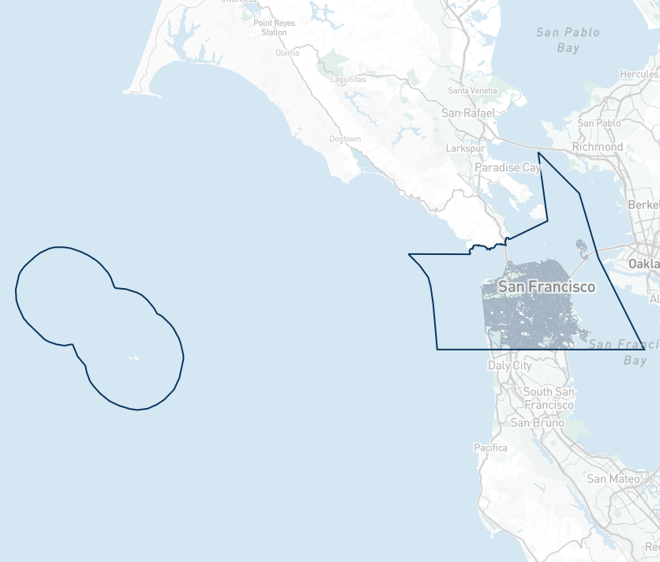

San Francisco is a consolidated city-county, and it includes some outlying islands. The outline on the left contains the [Farallon Islands](https://en.wikipedia.org/wiki/Farallon_Islands), which are protected and just home to some research stations. The pointy spur on the right outline reaches up to [Red Rock Island](https://en.wikipedia.org/wiki/Red_Rock_Island), a tiny uninhabited rock used to delineate the borders of SF county with two of its neighbors. These are some neat geography facts (_are they really?_), but all these islands lack the one thing I care about: public roads.

The area of the map we care about is way small! I made two changes to improve this experience. First, I now drop any city boundary polygons that don't have roads of interest. Second, the initial bounding box is now calculated from the roads, not the city border, so big empty areas won't stretch out the viewport.

Here's the centered view of SF now:

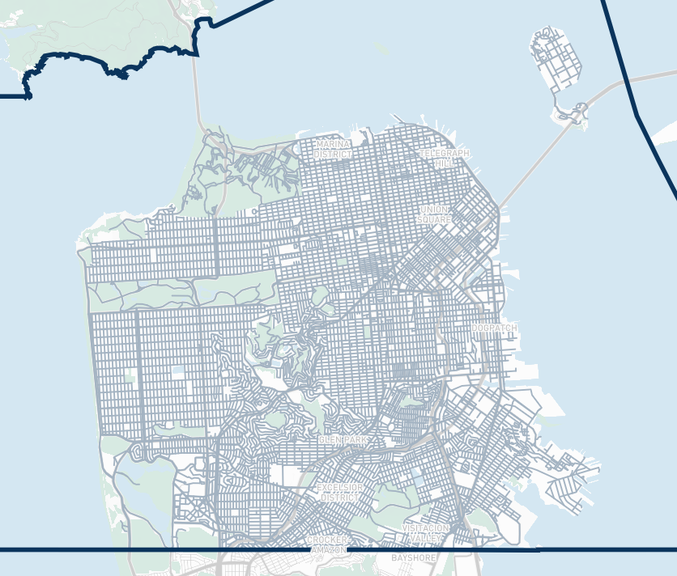

Great!
